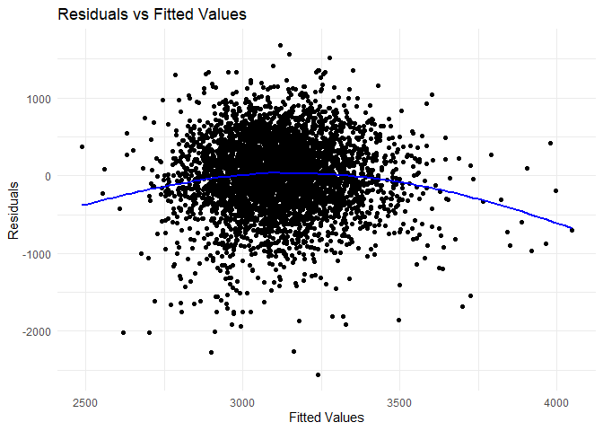

Solutions
================
2024-11-20

``` r
#cleaning
bwtdf = read.csv("birthweight.csv") |>
  mutate( frace = as.factor(frace),
          mrace = as.factor(mrace),
          babysex = as.factor(babysex)
  )
model <- lm(bwt ~ babysex + fincome + malform + wtgain + ppbmi, data = bwtdf)
tidy_fit <- model |>
  broom::tidy()
tidy_fit
```

    ## # A tibble: 6 × 5
    ##   term        estimate std.error statistic   p.value
    ##   <chr>          <dbl>     <dbl>     <dbl>     <dbl>
    ## 1 (Intercept)  2307.      56.7      40.7   8.61e-307
    ## 2 babysex2      -75.9     14.7      -5.16  2.63e-  7
    ## 3 fincome         3.15     0.283    11.1   2.55e- 28
    ## 4 malform       -60.9    125.       -0.486 6.27e-  1
    ## 5 wtgain         12.2      0.676    18.1   1.33e- 70
    ## 6 ppbmi          20.2      2.32      8.68  5.30e- 18

``` r
# Adding predictions and residuals to the data
train_data <- bwtdf |>
  add_predictions(model) |>
  add_residuals(model)
# Plot
ggplot(train_data, aes(x = pred, y = resid)) +
  geom_point() +
  geom_smooth(method = "loess", se = FALSE, color = "blue") +
  labs(title = "Residuals vs Fitted Values", x = "Fitted Values", y = "Residuals") +
  theme_minimal()
```

    ## `geom_smooth()` using formula = 'y ~ x'

<!-- -->
