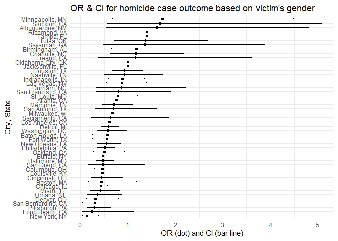
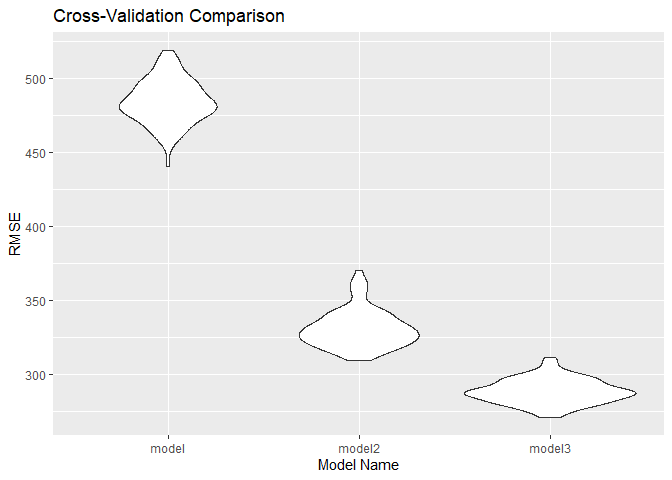
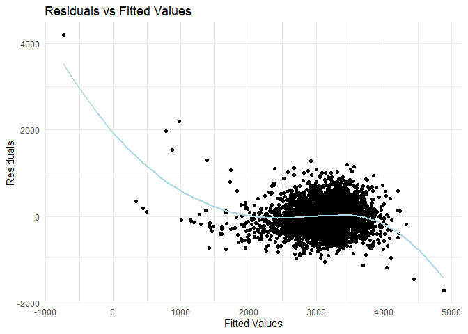
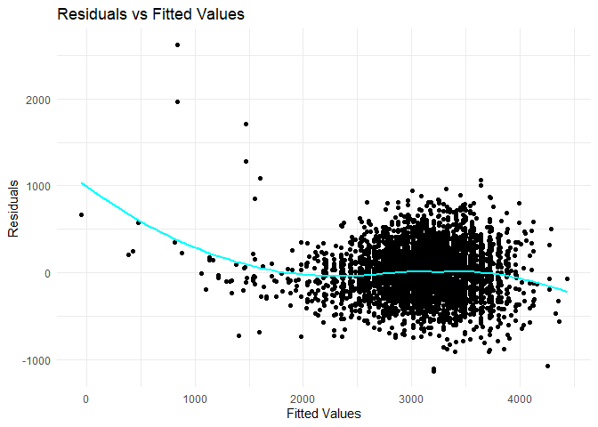

Solutions
================
2024-11-20

``` r
#PROBLEM 2
hom_data = read.csv("homicide-data.csv")|>
  janitor::clean_names()|>
  mutate(city_state = paste(city, state, sep = ", "))|>
  filter(city_state != c("Dallas, TX", "Phoenix, AZ", "Kansas City, MO")) |>
  filter(city_state != "Tulsa, AL") |>
  filter(victim_race == c("Black", "White")) |>
  mutate(victim_age = as.integer(victim_age)) |>
  mutate(
    disposition = str_replace(disposition, "Closed by arrest", "Solved"), 
    disposition = str_replace(disposition, "Closed without arrest", "Unsolved"), 
    disposition = str_replace(disposition, "Open/No arrest", "Unsolved")
  )|>
  mutate(disposition_binary = ifelse(disposition == "Solved", 1, 0))
```

    ## Warning: There was 1 warning in `mutate()`.
    ## ℹ In argument: `victim_age = as.integer(victim_age)`.
    ## Caused by warning:
    ## ! NAs introduced by coercion

``` r
balt_data = hom_data |>
  filter(city_state == "Baltimore, MD") |>
  select(city_state, disposition_binary, victim_age, victim_sex, victim_race)

glm_fit <- glm(disposition_binary ~ victim_age + victim_sex + victim_race, data = balt_data, family = binomial)

glm_fit |>
  broom::tidy() |>
  mutate(OR = exp(estimate), 
         CI_lower = confint(glm_fit)[,1], 
         CI_upper = confint(glm_fit)[,2]) |>
  select(term, log_OR = estimate, OR, CI_lower, CI_upper, p.value) |>
  knitr::kable(digits = 3)
```

    ## Waiting for profiling to be done...
    ## Waiting for profiling to be done...

| term             | log_OR |    OR | CI_lower | CI_upper | p.value |
|:-----------------|-------:|------:|---------:|---------:|--------:|
| (Intercept)      |  0.119 | 1.126 |   -0.360 |    0.602 |   0.627 |
| victim_age       | -0.003 | 0.997 |   -0.012 |    0.006 |   0.508 |
| victim_sexMale   | -0.758 | 0.469 |   -1.143 |   -0.374 |   0.000 |
| victim_raceWhite |  0.779 | 2.179 |    0.311 |    1.252 |   0.001 |

For male victims, the odds of solving a homicide case are 0.469 times
the odds for female victims in Baltimore.

``` r
nested_glm_results <- hom_data |>
  nest(data = -city_state) |>
  mutate(
    models = map(data, \(df) glm(disposition_binary ~ victim_age + victim_sex + victim_race, data = df, family = binomial)), 
    results = map(models, broom::tidy)) |>
  unnest(results)

# Calculating confidence intervals for the full model
conf_int_full_model <- confint.default(glm(disposition_binary ~ victim_age + victim_sex + victim_race, data = hom_data, family = binomial))

nested_glm_results |>
  select(city_state, term, estimate) |>
  mutate(term = fct_inorder(term)) |>
  pivot_wider(names_from = term, values_from = estimate) |>
  head(8) |>
  knitr::kable(digits = 4)
```

| city_state      | (Intercept) | victim_age | victim_sexMale | victim_raceWhite | victim_sexUnknown |
|:----------------|------------:|-----------:|---------------:|-----------------:|------------------:|
| Albuquerque, NM |      0.9890 |    -0.0155 |         0.4797 |          -0.1274 |                NA |
| Atlanta, GA     |      0.8934 |    -0.0073 |        -0.2902 |           0.7341 |                NA |
| Baltimore, MD   |      0.1190 |    -0.0030 |        -0.7577 |           0.7788 |                NA |
| Baton Rouge, LA |      0.8394 |    -0.0071 |        -0.5818 |           0.6367 |                NA |
| Birmingham, AL  |      0.7595 |    -0.0138 |         0.1590 |          -0.4963 |                NA |
| Boston, MA      |      0.6760 |    -0.0103 |        -0.8303 |           2.8013 |          -15.8767 |
| Buffalo, NY     |     -0.3975 |     0.0107 |        -0.7573 |           0.9092 |                NA |
| Charlotte, NC   |      1.3980 |    -0.0155 |         0.1561 |           0.8936 |                NA |

``` r
# Preparing data for plotting
plot_data <- nested_glm_results |>
  filter(term == "victim_sexMale") |>
  mutate(
    OR = exp(estimate),
    conf_low = map_dbl(city_state, ~ exp(confint.default(glm(disposition_binary ~ victim_age + victim_sex + victim_race, data = hom_data %>% filter(city_state == .x), family = binomial))["victim_sexMale", 1])),
    conf_high = map_dbl(city_state, ~ exp(confint.default(glm(disposition_binary ~ victim_age + victim_sex + victim_race, data = hom_data %>% filter(city_state == .x), family = binomial))["victim_sexMale", 2])),
    city_state = fct_reorder(city_state, OR)
  )

# Creating the plot
ggplot(plot_data, aes(x = OR, y = city_state)) + 
  geom_point() +
  geom_errorbar(aes(xmin = conf_low, xmax = conf_high), width = 0.2) +
  labs(
    x = "OR (dot) and CI (bar line)",
    y = "City, State",
    title = "OR & CI for homicide case outcome based on victim's gender"
  ) +
  theme_minimal()
```

<!-- -->

Comment on plot: For most cities, the OR is less than 1 which implies
that male victim’s cases have lower odds of being solved compared to
female victim’s.

``` r
#PROBLEM 3

#cleaning
bwtdf = read.csv("birthweight.csv") |>
  mutate( frace = as.factor(frace),
          mrace = as.factor(mrace),
          babysex = as.factor(babysex),
          malform = as.factor(malform)
  )|>
  drop_na()
model <- lm(bwt ~ babysex + fincome + wtgain + ppbmi, data = bwtdf)
tidy_fit <- model |>
  broom::tidy()
kable(tidy_fit, caption = "MLR stats")
```

| term        |    estimate |  std.error | statistic | p.value |
|:------------|------------:|-----------:|----------:|--------:|
| (Intercept) | 2307.212944 | 56.7070445 | 40.686531 |   0e+00 |
| babysex2    |  -75.747082 | 14.7102251 | -5.149281 |   3e-07 |
| fincome     |    3.147152 |  0.2830315 | 11.119443 |   0e+00 |
| wtgain      |   12.226201 |  0.6758845 | 18.089187 |   0e+00 |
| ppbmi       |   20.178428 |  2.3236904 |  8.683785 |   0e+00 |

MLR stats

``` r
# Adding predictions and residuals to the data
train_data <- bwtdf |>
  add_predictions(model) |>
  add_residuals(model)
# Plot
ggplot(train_data, aes(x = pred, y = resid)) +
  geom_point() +
  geom_smooth(method = "loess", se = FALSE, color = "blue") +
  labs(title = "Residuals vs Fitted Values", x = "Fitted Values", y = "Residuals") +
  theme_minimal()
```

    ## `geom_smooth()` using formula = 'y ~ x'

<!-- --> Modelling
process- I decided to use the variables family income, baby’s sex,
mother’s pre pregnancy BMI and weight gain during pregnancy. Baby’s sex
is a biological trait which influences weight (boys tend to weigh more).
The others were related to the mother’s weight and economic conditions.
The table we made suggested that all these 4 variables have a
statistically significant relationship (very small p values).

About the plot: Our plot indicates that our model is not the best-
i.e. our choice of variables for predicting weight and the way we
constructed the model could have been better. Ideally, we want the line
to be flatter and closer to zero to signify a linear relationship. The
line is only close to 0 in the middle. Some of our points are very far
from 0 which is not what we want.

Q- Compare your model to two others:

One using length at birth and gestational age as predictors (main
effects only) One using head circumference, length, sex, and all
interactions (including the three-way interaction) between these

Make this comparison in terms of the cross-validated prediction error;
use crossv_mc and functions in purrr as appropriate.

Making two more models and comparing as instructed:

``` r
model2 = lm(bwt ~ blength + gaweeks, data = bwtdf)
model3 = lm(bwt ~ bhead + blength + babysex + 
              bhead * blength * babysex + blength * babysex + babysex * bhead
             + blength * bhead, data = bwtdf)
# Setting seed for reproducibility
set.seed(123)

# Creating Monte Carlo cross-validation folds
cv_folds <- crossv_mc(bwtdf, n = 100, test = 0.2) |> 
  mutate(
    train = map(train, as_tibble),
    test = map(test, as_tibble)
  )

# Fitting models
cv_folds <- cv_folds |> 
  mutate(
    fit_model = map(train, ~ lm(formula(model), data = .)),
    fit_model2 = map(train, ~ lm(formula(model2), data = .)),
    fit_model3 = map(train, ~ lm(formula(model3), data = .))
  )

# Calculating RMSE for each model
cv_folds <- cv_folds |> 
  mutate(
    rmse_model = map2_dbl(fit_model, test, ~ rmse(model = .x, data = .y)),
    rmse_model2 = map2_dbl(fit_model2, test, ~ rmse(model = .x, data = .y)),
    rmse_model3 = map2_dbl(fit_model3, test, ~ rmse(model = .x, data = .y))
  )

# Reshaping and plotting the results
cv_folds |> 
  select(starts_with("rmse")) |> 
  pivot_longer(
    cols = everything(),
    names_to = "model",
    values_to = "rmse",
    names_prefix = "rmse_"
  ) |> 
  mutate(model = fct_inorder(model)) |> 
  ggplot(aes(x = model, y = rmse)) +
  geom_violin() +
  labs(
    x = "Model Name",
    y = "RMSE",
    title = "Cross-Validation Comparison"
  )
```

<!-- -->

Our third model (using head circumference, length, sex, and all
interactions (including the three-way interaction) demonstrates the
lowest RMSE, indicating it provides the best fit among the models
tested. The second model follows as the next best performer, while the
initial model we started with exhibits the highest RMSE and thus the
least effective.

We can make plots like we did for our original model to confirm:

``` r
train_data_ <- bwtdf |>
  add_predictions(model2) |>
  add_residuals(model2)
# Plot
ggplot(train_data_, aes(x = pred, y = resid)) +
  geom_point() +
  geom_smooth(method = "loess", se = FALSE, color = "lightblue") +
  labs(title = "Residuals vs Fitted Values", x = "Fitted Values", y = "Residuals") +
  theme_minimal()
```

    ## `geom_smooth()` using formula = 'y ~ x'

<!-- -->

``` r
train_data_new <- bwtdf |>
  add_predictions(model3) |>
  add_residuals(model3)
# Plot
ggplot(train_data_new, aes(x = pred, y = resid)) +
  geom_point() +
  geom_smooth(method = "loess", se = FALSE, color = "cyan") +
  labs(title = "Residuals vs Fitted Values", x = "Fitted Values", y = "Residuals") +
  theme_minimal()
```

    ## `geom_smooth()` using formula = 'y ~ x'

<!-- -->

Plot for model2- Line is not flat and not close to 0 at lower and higher
values. We observe that model3 is better from the plots.

Plot for model3 -We observe that apart from the start, the line is flat
and close to 0 and the points aren’t as scattered away from 0 as in our
first plot. This signifies an improvement. However, there are still
issues with this model (especially for lower values of the fitted
variable).
